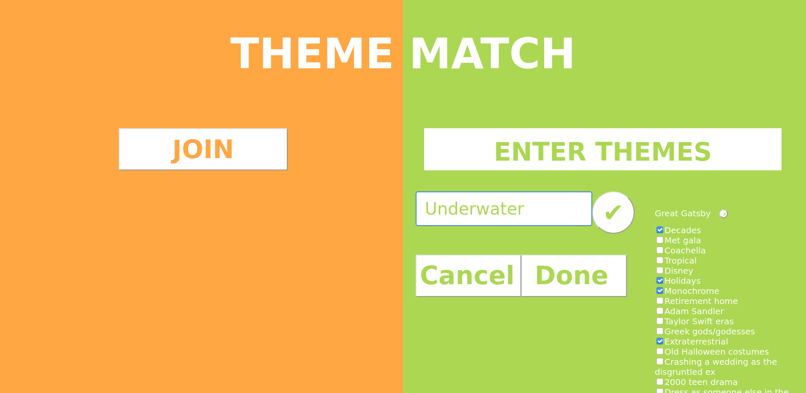
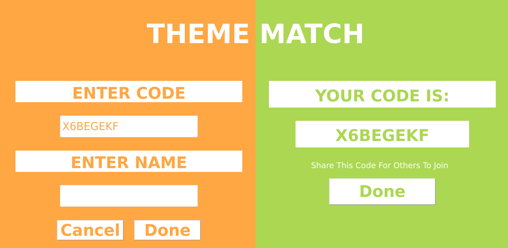
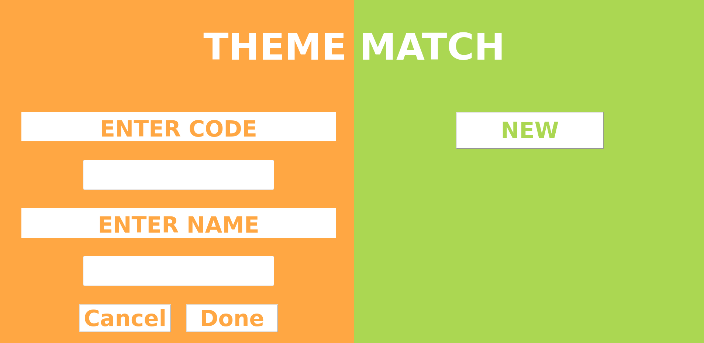

# Theme Match

This website can be used to create a list of themes (for example, for a dress up party) and randomly match each person to one of the themes.

## Creating A New Theme Matcher

One member can add in themes manually or select themes from a list of possible options. When a new theme matcher is created, a code is generated that can be shared with the rest of the group.

## Joining and Getting Your Theme

To join, enter the code and your name. Each person can only join once, so if you have the same first name, add a last initial or use a nickname. Then, you will be randomly assigned a unique theme

## Overall

Enjoy and have fun with this themed party idea!
